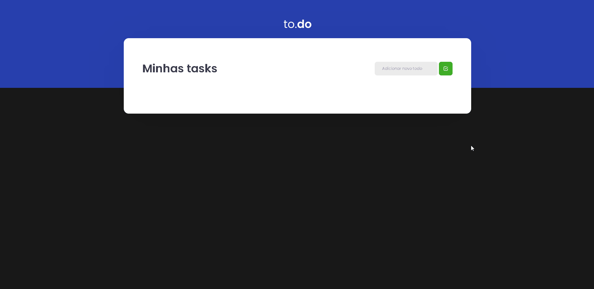

<h1 align="center">
  
</h1>

 

## **<h2 align="center">Aplicação Front end📟 👨‍💻</h2>**

## 
<h2 align="center">Aplicação To Do desenvolvida no primeiro desafio da Trilha ReactJS do Ignite ministrado pela [Rocketseat](https://app.rocketseat.com.br/dashboard)</h2> 

## 
  

<h3>Além do desafio proposto, alterei o tema da aplicação para dark, animações foram adicionadas e algumas pequenas mudanças no css</h3>

  <a href="#computer-demonstration-of-the-application">Demonstration of the application</a>&nbsp;&nbsp;&nbsp;|&nbsp;&nbsp;&nbsp;
  <a href="#star-features">Features</a>&nbsp;&nbsp;&nbsp;|&nbsp;&nbsp;&nbsp;
  <a href="#rocket-technologies-used">Technologies used</a>&nbsp;&nbsp;&nbsp;|&nbsp;&nbsp;&nbsp;
  <a href="#information_source-application-installation">Application installation</a>

# :computer: Demonstration of the application

  

 

<h3 align="center"> 
	 Application status: Developed ✔️
</h3>
 

## :star: Features
- [x] Adicionar uma nova tarefa
- [x] Marcar uma tarefa como concluída ou o contrário
- [x] Excluir uma tarefa

## :rocket: Technologies used:

 

## :information_source: Application installation
- `git clone https://github.com/mathwcruz/ignite-desafio_01-trilha-reactjs-todo.git` para clonar o repositório

 

# 🎲 Run application
Para rodar a aplicação na web, siga as instruções a partir do seu terminal:
- `cd ignite-desafio_01-trilha-reactjs-todo` e `code .`
- rode `yarn` para instalar as dependências do projeto
- Após ter baixado as dependências, rode `yarn dev` para rodar a aplicação
- Entra no `localhost:8080` para visualizar a aplicação web

 

### Autor
---

<a href="https://app.rocketseat.com.br/me/matheus-da-cruz-frontend">
 
  
 <b>Matheus da Cruz</b></a> <a href="https://app.rocketseat.com.br/me/matheus-da-cruz-frontend" title="Rocketseat">  🚀</a>

Desenvolvido por Matheus da Cruz 😊

 

 

## **
Iniciando a caminhada para poder participar da maratona nesse mundo da programação 🏃‍
**

### 
 <h2 align="center"> Mais uma aplicação realizada por Matheus da Cruz 👨‍💻 </h2> 

